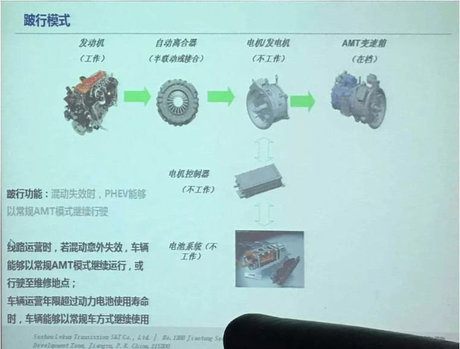

## 微信公众号文章信息提取

### wechat_img.py

- 1.提取微信文章图片
- 2.ABBYY表格信息OCR提取
- 3.python可视化无人驾驶公司统计信息

### ppt2reveal.py

- 通过python将ppt转为reveal.js,解决不同机器因office 版本出现的异常播放问题

[online demo ](https://baifengbai.github.io/2_reveal)


### shenglv.ipynb

- 爬取声律启蒙并转为胎教音乐，用到baidu aip-speech

### BaiduNews.py

- 通过关键词爬取百度新闻分析新闻热度及媒体分布


### itchat_poem.ipynb

- itchat微信自定义机器人，定时发送指定内容

### ppt_correct.ipynb

- 手机拍摄的PPT图片歪斜自动校正




### seamcarver 

- 图片内容感知缩放，不会导致图片失真


### combine_files.py

- 合并markdown文件

```python
import os
f1=open('test.md','w+')
for dirpath, dirnames, filenames in os.walk('./'):
    for file in filenames:
        if file.endswith('.md'):
            with open('./{}'.format(file),'r') as f:
                f1.write(f.read())
```
